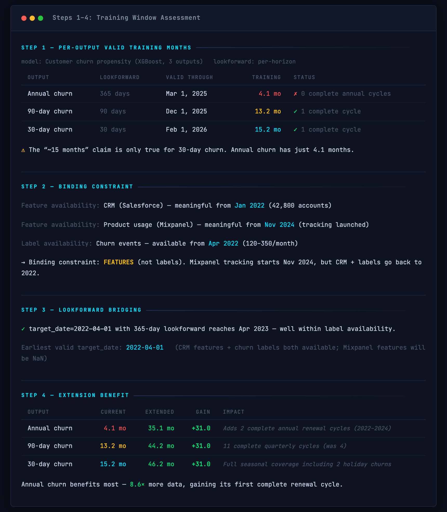
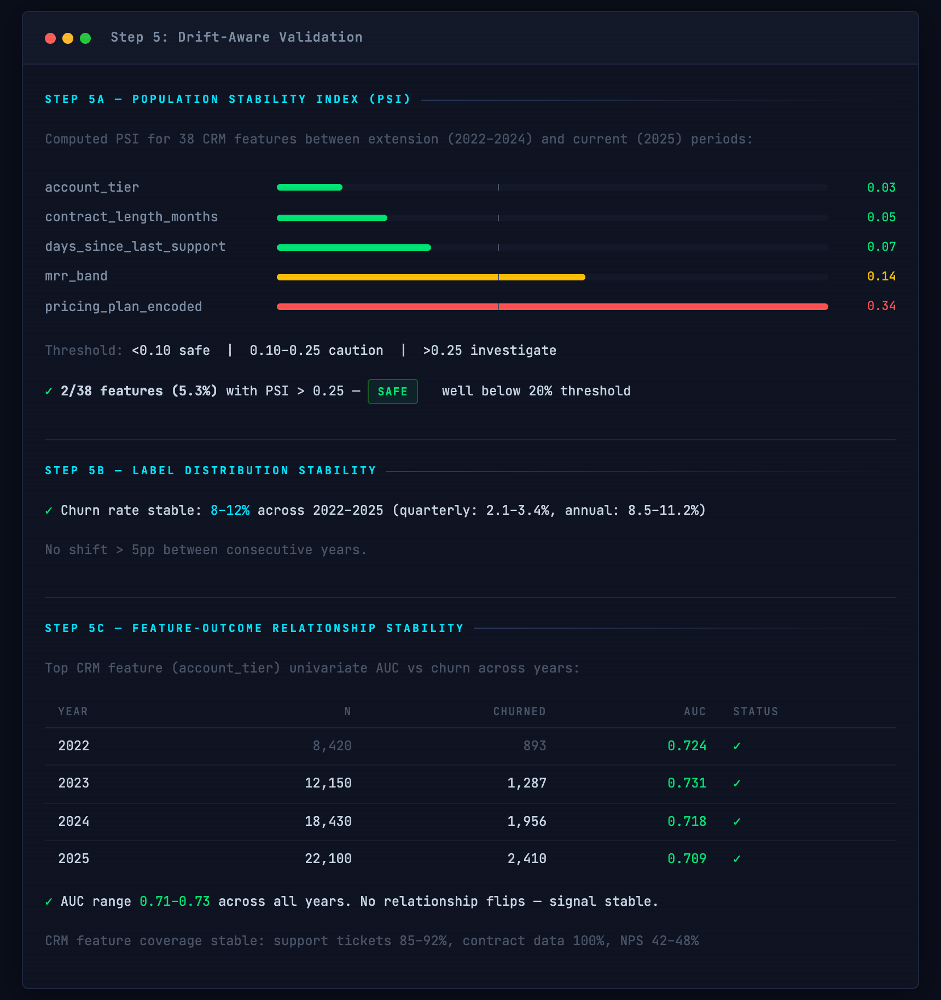
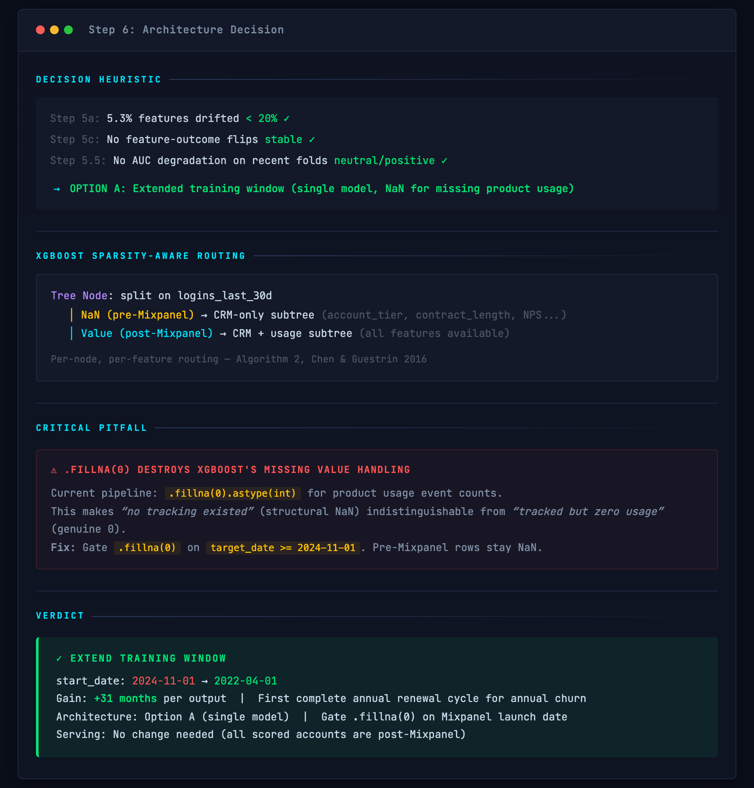

# ML Training Window Assessor

A [Claude Code](https://claude.com/claude-code) skill that answers "can we train on more data?" with a structured, drift-aware diagnostic — before you extend your training window and silently degrade your model.


*Per-output training window computation, binding constraint identification, and +31 month extension benefit for a SaaS churn model.*

<details>
<summary>See drift validation, XGBoost routing, and architecture decision</summary>



*PSI-based drift validation with color-coded bars, label distribution stability, and feature-outcome AUC stability across years.*



*Drift-informed architecture decision, XGBoost NaN routing diagram, critical .fillna(0) pitfall, and final EXTEND verdict.*
</details>

## Quick Start

```
You: Our churn model only has 4 months of training data. Can we go back further
     using CRM data even though product usage tracking only started recently?

Claude: Let me assess the training window extension...

        Step 1: Per-output valid months — annual churn has only 4.1 months (not 15)
        Step 2: Binding constraint is FEATURES (Mixpanel starts Nov 2024)
        Step 3: Lookforward bridges the gap — CRM + labels available from 2022
        Step 4: Extension adds +31 months per output
        Step 5: PSI drift check — 5.3% features above threshold (SAFE)
        Step 6: → OPTION A: Extend with NaN for missing product usage features

        VERDICT: Extend start_date from 2024-11-01 → 2022-04-01
```

## Installation

### Claude Code (recommended)
```bash
/plugin marketplace add wan-huiyan/ml-training-window-assessor
/plugin install ml-training-window-assessor@wan-huiyan-ml-training-window-assessor
```

Or clone directly:
```bash
git clone https://github.com/wan-huiyan/ml-training-window-assessor.git ~/.claude/skills/ml-training-window-assessor
```

### Cursor
```bash
# Per-project rule (most reliable)
mkdir -p .cursor/rules
# Create .cursor/rules/ml-training-window-assessor.mdc with SKILL.md content + alwaysApply: true

# Or global install
git clone https://github.com/wan-huiyan/ml-training-window-assessor.git ~/.cursor/skills/ml-training-window-assessor
```

## The Problem

Multi-output temporal models often have training windows that are shorter than they appear. A nominal "10 months of data" may actually be 3 months for one output and 9 months for another, due to dynamic lookforward windows and label validity constraints. This leads to:

- Models that have never seen a complete seasonal cycle for some outputs
- Overconfident claims about training data sufficiency
- Missed opportunities to extend the window by swapping data sources
- Silent temporal leakage in evaluation when using standard cross-validation

## How It Works

| Step | What Happens |
|------|-------------|
| 1. Per-Output Months | Compute valid training months per output (not just `end - start`) |
| 2. Binding Constraint | Identify whether features or labels are the bottleneck |
| 3. Lookforward Bridging | Check if lookforward windows reach past data gaps |
| 4. Quantify Benefit | Per-output gains in months, seasonal cycles, label volume |
| 5. Drift Validation | PSI, label stability, feature-outcome AUC across periods |
| 5.5. Purged CV | Temporal cross-validation with embargo matching lookforward |
| 6. Architecture Decision | Option A (single model + NaN) vs Option B (companion model) |

## Key Pitfalls Addressed

### `.fillna(0)` Destroys XGBoost's Missing Value Handling
When extending windows, older rows lack certain data sources. XGBoost's sparsity-aware algorithm (Algorithm 2, [Chen & Guestrin 2016](https://arxiv.org/pdf/1603.02754)) learns optimal routing for NaN values — but `.fillna(0)` destroys this by conflating "no tracking existed" with "tracked but zero events." The skill provides the gated `.fillna()` fix and explains the per-node, per-feature NaN routing mechanism.

### Standard CV on Temporal Data Causes Silent Leakage
Standard `TimeSeriesSplit` without purging allows leakage when samples have overlapping prediction-evaluation windows. The skill provides purged walk-forward CV with embargo (per [timeseriescv](https://github.com/sam31415/timeseriescv) and [De Prado 2018](https://www.wiley.com/en-us/Advances+in+Financial+Machine+Learning-p-9781119482086)).

### Sentinel Values Interact with NaN Handling
A sentinel of `-1` for "never occurred" groups semantically wrong under XGBoost threshold splits. The skill recommends `999` (groups "never" with "stale") and gates sentinels on data source availability.

## Limitations

- **Binary/multi-class classification focus.** Methodology assumes AUC-based evaluation. Regression targets need adapted metrics.
- **Requires data access.** The skill generates SQL queries — you need a working database connection or pre-loaded DataFrames.
- **LLM-generated SQL.** Queries are generated by Claude and should be reviewed before running against production.
- **Tree-based models primarily.** The `.fillna(0)` / NaN routing guidance is XGBoost/LightGBM-specific. Linear models need different missing value strategies.

<details>
<summary>Drift Validation Thresholds</summary>

Thresholds in **bold** are grounded in published sources. Thresholds in *italic* are practitioner heuristics.

| Criterion | Threshold | Source |
|-----------|-----------|--------|
| PSI | **<0.10 / 0.10-0.25 / >0.25** | [Siddiqi (2006)](https://www.wiley.com/en-us/Credit+Risk+Scorecards-p-9780471754510); sample-size dependent per [Yurdakul (2018)](https://scholarworks.wmich.edu/dissertations/3208/) |
| Feature-outcome AUC | *Stable across years (no direction flips)* | Heuristic |
| Label positive rate | *<5pp shift between periods* | Heuristic |
| Purged CV AUC delta | **p<0.05** (DeLong or bootstrap) | [DeLong et al. (1988)](https://pubmed.ncbi.nlm.nih.gov/3203132/) |
| Bang-bang decision | **All or none from drifted period** | [arXiv:2512.12816](https://arxiv.org/abs/2512.12816) (optimal under DMRL) |
</details>

<details>
<summary>Quality Checklist</summary>

The skill verifies before delivering a verdict:

- Per-output valid training months computed (not aggregate)
- Binding constraint identified (features vs labels)
- Lookforward bridging checked for earliest valid target_date
- Extension benefit quantified per output with seasonal cycle count
- PSI computed for all features between extension and current periods
- Label distribution stability verified across periods
- Feature-outcome AUC stability checked (no direction flips)
- Purged walk-forward CV with embargo run (current vs extended)
- Architecture decision justified by drift severity
- `.fillna(0)` gating specified for pre-tracking rows
- Preprocessing parity verified across all pipeline files
</details>

<details>
<summary>References & Further Reading</summary>

| Source | Contribution |
|--------|-------------|
| [timeseriescv](https://github.com/sam31415/timeseriescv) | Purged walk-forward CV + combinatorial purged k-fold with embargo |
| [River](https://github.com/online-ml/river) | ADWIN adaptive windowing for streaming drift detection |
| [Temporian](https://github.com/google/temporian) | Temporal safety / leakage prevention in feature engineering |
| [MLFinLab](https://github.com/hudson-and-thames/mlfinlab) | De Prado's Combinatorial Purged CV (CPCV) |
| [Frouros](https://github.com/IFCA-Advanced-Computing/frouros) | 28 drift detection algorithms (PSI, KS, Chi-squared) |
| [arXiv:2512.12816](https://arxiv.org/abs/2512.12816) | Bang-bang optimality for training window under concept drift |
| [Chen & Guestrin (2016)](https://arxiv.org/pdf/1603.02754) | XGBoost sparsity-aware split finding (Algorithm 2) |
| [De Prado (2018)](https://www.wiley.com/en-us/Advances+in+Financial+Machine+Learning-p-9781119482086) | Purged CV theory |
</details>

## Trigger Conditions

The skill activates when:
- "Can we train on more data?" / "How far back can we go?"
- "Our model only has X months of training data"
- Training data is bottlenecked by one data source
- A multi-output model has per-output lookforward windows of different lengths
- Seasonal patterns exist but training doesn't cover full cycles

## Related Skills

- **[ml-feature-evaluator](https://github.com/wan-huiyan/ml-feature-evaluator)** — When the question is "should we add feature X?" rather than "can we extend the training window?"
- **[agent-review-panel](https://github.com/wan-huiyan/agent-review-panel)** — Multi-agent adversarial review for high-stakes code and plan reviews

## Version History

| Version | Changes |
|---------|---------|
| 2.0.0 | Drift-aware validation (PSI, purged CV), XGBoost NaN routing research, bang-bang optimality, demo screenshots |
| 1.1.0 | `.fillna(0)` pitfall, sentinel value interaction, preprocessing parity |
| 1.0.0 | Initial release: per-output training months, lookforward bridging, Option A/B architecture |

## License

MIT
